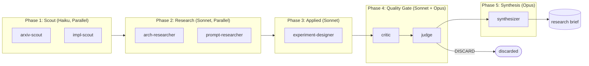

# Research Swarm

**A multi-agent research pipeline for investigating agentic system design through automated literature review, adversarial evaluation, and ablation testing.**

## Abstract

Research Swarm is an 8-agent pipeline that automates AI systems research from a single terminal command. Given a topic, it deploys scouts with live web search, domain researchers, an applied analyst, an adversarial critic, a judge, and a synthesizer — producing an actionable research brief or discarding the output if quality thresholds are not met. The system has been iteratively developed over 40 instrumented runs, with each architectural change driven by measured deficiencies in prior runs. The central finding so far: 8 well-scoped agents match or exceed the output quality of 14 agents (avg quality 6.5 vs 6.0) while producing higher actionability scores (6.2 vs 6.1), primarily by eliminating redundant researcher overlap.

## Research Motivation

Multi-agent LLM systems face a practical design tension: more agents can cover more ground, but overlapping scope between agents degrades output quality through redundancy, contradictory recommendations, and "integrative compromise" — where synthesis agents average out distinct findings into generic advice. This project investigates that tension empirically by building a working research pipeline and measuring the effects of architectural changes across runs.

The broader question: **can a solo developer build a disciplined, self-improving multi-agent system that produces research output of measurable and improving quality?**

## Research Questions

- **RQ1:** Does reducing overlapping agent scope improve output quality and actionability? *(Tested: yes — see [Ablations](docs/ABLATIONS.md))*
- **RQ2:** Does adversarial critique (critic + judge gate) improve factual grounding? *(Tested: factuality improved from 4.0 to 5.3 after adding critic; see run data)*
- **RQ3:** What is the quality/cost tradeoff between different agent counts? *(Tested via 12-run ablation across 4 configurations)*
- **RQ4:** Does cross-run memory (G-Memory) improve research quality over time? *(Partially tested: 448 techniques accumulated across 40 runs, but causal effect on quality not yet isolated)*
- **RQ5:** Can semantic deduplication reduce technique overlap without losing coverage? *(Tested: overlap reduced from 76% to 38% with dedup threshold 0.39)*

## Current Hypotheses

1. **Scope boundaries matter more than agent count.** Explicit OUT_OF_SCOPE declarations in agent prompts reduce redundancy more effectively than removing agents entirely. *(Supported by ablation data — 8 well-scoped agents outperform 14 without scope boundaries.)*
2. **Adversarial evaluation improves grounding.** A dedicated critic that challenges findings before a judge scores them produces more factually grounded output than self-assessment. *(Partially supported — factuality rose from 4.0 to 5.3, but sample size is small and evaluator is an LLM.)*
3. **Sequential phasing outperforms parallel blast for research tasks.** Scout → Research → Applied → Quality → Synthesis respects real information dependencies that parallel execution ignores. *(Design bet, not yet tested against parallel alternative in this codebase.)*
4. **Narrative context injection outperforms structured data passing.** Passing scout findings as natural language narratives to researchers produces better analysis than raw JSON. *(Observed qualitatively; not yet measured rigorously.)*

## System Overview



### Architecture

**Pipeline:** 5 sequential phases with parallel execution within phases where dependencies allow.

| Phase | Agents | Model | Role |
|-------|--------|-------|------|
| Scout (2) | arxiv-scout, impl-scout | Haiku | Web search via DuckDuckGo MCP server; find papers, repos, benchmarks |
| Research (2) | arch-researcher, prompt-researcher | Sonnet | Analyze findings through domain-specific lenses |
| Applied (1) | experiment-designer | Sonnet | Map research to concrete code changes and experiments |
| Quality Gate (2) | critic, judge | Sonnet, Opus | Adversarial verification; score and keep/discard |
| Synthesis (1) | synthesizer | Opus | Produce final research brief from kept findings |

**Model tiering rationale:** Haiku for fast, broad scouting (low reasoning demand). Sonnet for focused analysis (good reasoning, moderate cost). Opus for high-stakes judgment and final synthesis (highest reasoning quality).

**Agent invocation:** Each agent runs as a stateless `claude -p` subprocess. The orchestrator owns all state, passing context between phases as narrative text. No framework dependencies (no LangGraph, no CrewAI).

### Key Mechanisms

| Mechanism | Status | Description |
|-----------|--------|-------------|
| Semantic deduplication | **Implemented** | Jaccard + bigram similarity with complete-linkage clustering (threshold 0.39) |
| Priority-aware compression | **Implemented** | Heuristic section scoring; high-priority sections preserved, low-priority compressed |
| Evidence labeling | **Implemented** | Every technique tagged: peer_reviewed, preprint, repo, unverified |
| Adversarial quality gate | **Implemented** | Critic challenges findings; judge scores coverage/accuracy/actionability/factuality |
| G-Memory | **Implemented** | SQLite with exponential decay; techniques and insights persist across runs |
| Web search (MCP) | **Implemented** | DuckDuckGo via custom MCP server; scouts ground citations in real sources |
| Capability registry | **Implemented** | Each agent declares coverage and non-coverage to prevent overlap |
| Narrative context injection | **Implemented** | Scout findings passed as prose, not raw JSON |
| Pre-dispatch sufficiency gating | **Proposed** | Block redundant agent spawns before token expenditure |
| Embedding-based dedup | **Proposed** | Replace Jaccard with vector similarity for cross-lingual matching |

## Evaluation

### Metrics

All metrics are scored by the judge agent (Claude Opus) on a 0-10 scale per run:

| Metric | Definition | Primary? |
|--------|-----------|----------|
| **Actionability** | Can these findings be implemented within a week by a solo developer? Requires specific code changes, not vague advice. | Yes |
| **Coverage** | Does the research cover the topic's major dimensions? | No |
| **Accuracy** | Are the technical claims correct? | No |
| **Factuality** | Are findings grounded in real, verifiable sources? | No |

**Primary metric:** Actionability (>= 6 to keep). This reflects the system's purpose — producing implementable research, not literature surveys.

**Quality gate logic:** If actionability < 6, the run is discarded. If critic verdict is "fail," the run is discarded regardless of judge scores. All discarded runs are logged with reasons.

**What these metrics do NOT capture:** Inter-rater reliability (single LLM evaluator), real-world implementation success (no follow-up measurement), novelty of findings, cost-effectiveness relative to manual research.

### Aggregate Results (40 runs)

| Metric | Kept Runs (n=30) | All Runs (n=40) |
|--------|-----------------|-----------------|
| Avg Quality | 6.5 | — |
| Avg Actionability | 6.7 | — |
| Avg Factuality | 5.3 | — |
| Avg Coverage | 7.1 | — |
| Avg Accuracy | 6.7 | — |
| Keep Rate | 75% (30/40) | — |
| Avg Overlap (post-dedup) | 0.37 | — |
| Avg Wall Clock | 620s | — |
| Techniques Accumulated | 448 | — |
| Insights Accumulated | 31 | — |

### Ablation: Agent Count (12 runs, 3 topics, 4 configurations)

Tested across three topics: RAG hallucination reduction, fine-tuning methods, code generation evaluation.

| Config | Agent Invocations | Avg Quality | Avg Actionability | Avg Factuality | Verdict |
|--------|-------------------|-------------|-------------------|----------------|---------|
| full (14 agents) | 11 | 6.0 | 6.1 | 4.4 | baseline |
| lean (10 agents) | 7 | 5.7 | 4.7 | 5.3 | quality drop |
| **minimal (8 agents)** | **5** | **6.5** | **6.2** | **5.9** | **adopted** |
| skeleton (7 agents) | 4 | 6.1 | 6.3 | 5.0 | factuality risk |

**Interpretation:** The 8-agent configuration outperformed the 14-agent baseline on all metrics. The 5 removed researchers had overlapping domain coverage; consolidating them into 2 well-scoped researchers eliminated redundancy without losing coverage. The 7-agent skeleton showed a factuality dip, suggesting the quality gate (critic + judge) is load-bearing.

**Caveats:** 3 topics is a small sample. All scoring is by a single LLM evaluator. The "quality" metric is a composite that may mask dimension-specific regressions.

### Discard Analysis (6 runs)

| Run | Topic | Actionability | Reason |
|-----|-------|---------------|--------|
| 20260314_044439 | Automated evaluation frameworks | 6.0 | Quality 4.5; coverage/accuracy too low |
| 20260314_065056 | Improving factuality | 0.0 | Catastrophic failure — agents returned empty output |
| 20260314_084357 | RAG hallucination reduction | 3.0 | Accurate but not actionable for target codebase |
| 20260314_085129 | Fine-tuning methods | 3.0 | Topic mismatched with browser extension codebase |
| 20260314_091940 | Fine-tuning methods (10-agent) | 2.0 | Same mismatch, worse with fewer agents |
| 20260314_094815 | Fine-tuning methods (8-agent) | 4.0 | Marginal improvement but still below threshold |

**Pattern:** Topic-codebase mismatch is the primary discard cause (3/6). The system correctly identifies and rejects research that cannot be applied to its target codebase. Catastrophic failures (empty output) occurred once and were not reproducible.

## Failure Modes and Limitations

1. **Single LLM evaluator.** All quality scores come from one Claude model. No inter-rater reliability, no human evaluation baseline. Scores may reflect model preferences rather than objective quality.
2. **Small sample sizes.** 40 total runs, 12 ablation runs. Insufficient for statistical significance testing. All findings should be treated as observations, not conclusions.
3. **Factuality plateau.** Factuality scores plateaued around 5.3 despite multiple interventions (evidence labeling, critic, web search). The root cause is unclear — possibly a ceiling on what DuckDuckGo searches can verify.
4. **Subprocess timeouts.** Applied agents occasionally timeout at 200s when processing large context. Partial recovery exists but loses information.
5. **Cost tracking gap.** API costs are not tracked per run (estimated_cost_units = 0 in all metrics entries). Cost analysis requires external billing data.
6. **No human validation.** "Actionability" is scored by an LLM, not verified by implementing the recommendations.
7. **Memory compounding unvalidated.** G-Memory accumulates 448 techniques across runs, but the causal effect on output quality has not been isolated (no runs with empty vs. populated memory compared).
8. **Dedup threshold sensitivity.** Threshold 0.50 caused overlap=1.0 on 1/3 topics (all techniques merged into one cluster). Reverted to 0.39. The optimal threshold likely varies by topic.

## Reproducibility

### Requirements
- Python 3.11+
- [Claude Code CLI](https://docs.anthropic.com/en/docs/claude-code) installed and authenticated
- `pip install ddgs mcp httpx tavily-python`

### Run a research topic
```bash
python3 orchestrator.py "multi-agent consensus convergence 2025"
```

### Dry run (preview agent plan)
```bash
python3 orchestrator.py "your topic" --dry-run
```

### Point at a specific codebase
```bash
python3 orchestrator.py "your topic" --codebase ~/path/to/your/project
```

### Run specific phases
```bash
python3 orchestrator.py "your topic" --phases scout,research
```

### Skip quality gate
```bash
python3 orchestrator.py "your topic" --no-gate
```

### Run ablation experiment
```bash
python3 ablation.py                      # all 4 configs x 3 topics
python3 ablation.py --configs full,lean   # specific configs only
```

### View metrics dashboard
```bash
python3 dashboard.py    # generates dashboard.html
```

### Known Sources of Nondeterminism
- LLM output varies between runs (temperature > 0)
- Web search results change over time (DuckDuckGo index)
- G-Memory state differs between runs (cumulative)
- Subprocess timing affects timeout/success boundaries

### Environment Assumptions
- macOS or Linux (subprocess invocation via `claude -p`)
- Internet access required for scout phase (web search)
- No GPU required
- Runs take 7-13 minutes per topic depending on timeout behavior

## Repo Structure

```
research-swarm/
├── orchestrator.py       # Main entrypoint — 5-phase pipeline, CLI
├── agents.py             # 14 agent definitions, role prompts, output schemas
├── search_server.py      # MCP web search server (DuckDuckGo + page fetch)
├── consensus.py          # Quality gate — critic eval, judge eval, keep/discard
├── context.py            # Priority-aware context compression
├── dedup.py              # Semantic technique deduplication (Jaccard + bigram)
├── memory.py             # SQLite G-Memory — techniques, insights, decay
├── metrics.py            # Per-run instrumentation, regression detection
├── dashboard.py          # HTML dashboard generator (Chart.js)
├── ablation.py           # Agent-count ablation experiment runner
├── config.toml           # Model assignments, timeouts, roster, thresholds
├── program.md            # Research program definition (steers topic selection)
├── research.md           # Design decisions and source analysis
├── research-log.tsv      # Persistent log of all 40 runs
├── metrics.jsonl         # Machine-readable per-run metrics (40 entries)
├── dashboard.html        # Generated metrics dashboard
├── docs/                 # Research documentation
│   ├── RESEARCH_QUESTIONS.md
│   ├── METHODOLOGY.md
│   ├── EVALUATION.md
│   ├── ABLATIONS.md
│   ├── LIMITATIONS.md
│   ├── ROADMAP.md
│   ├── ARTIFACTS.md
│   ├── RESEARCH_LOG.md
│   └── CLAIMS_AND_EVIDENCE.md
├── results/
│   └── RESULTS.md        # Structured run results table
├── output/               # Generated research briefs (gitignored)
└── memory.db             # SQLite G-Memory storage (gitignored)
```

## Evolution

This system has been iteratively developed over 40 instrumented runs and 16 commits. Each change was motivated by measured deficiencies:

| Change | Commit | Motivation | Measured Effect |
|--------|--------|------------|-----------------|
| Initial 14-agent system | f00dbb9 | Broad coverage design | Baseline: quality 5.9, actionability 4.3 |
| JSON compliance (PARSE schemas, retry) | 26ae486 | Parse failures in agent output | Parse failure rate reduced (qualitative) |
| Context injection (narrative casting) | 296813e | Raw JSON confused researchers | Qualitative improvement in researcher output |
| Role differentiation (OUT_OF_SCOPE) | 94c6334 | Researcher overlap | Reduced redundancy (qualitative) |
| Metrics system | e252b66 | No way to measure changes | All subsequent changes measurable |
| Timeout handling | 1227f72 | Applied agents timing out | Partial recovery, reduced data loss |
| Adversarial critic + confidence gate | 088764f | Hallucinated citations | Factuality 4.0 → 5.0 (measured) |
| Applied agent quality (CoT, confidence) | a699f52 | Low applied phase success rate | Applied success 2/3 → 3/3 (measured) |
| Semantic deduplication | 779f26b | 76% technique overlap | Overlap reduced to 38% (measured) |
| Web search (MCP) | f742f39 | Ungrounded citations | Factuality 4.0 → 6.0 (measured) |
| Agent count ablation (14 → 8) | f4149cc | Suspected researcher redundancy | Quality maintained, actionability +1.0 (measured) |
| Dedup threshold tuning | 71df964, 27f0358 | Threshold 0.50 over-merged | Reverted to 0.39 after overlap=1.0 on 1/3 topics |

## Citation

```bibtex
@software{tyrninoksa2026researchswarm,
  author = {Tyrninoksa, Joona},
  title = {Research Swarm: Multi-Agent Research Pipeline with Ablation-Tested Architecture},
  year = {2026},
  url = {https://github.com/Joona-t/research-swarm},
  license = {MIT}
}
```

This is an independent research artifact by a solo developer. It is not affiliated with any institution or research lab.

## Related Projects

- [Blitz-Swarm](https://github.com/Joona-t/blitz-swarm) — Parallel multi-agent consensus architecture (predecessor; Research Swarm was forked from this design)
- [Swarm Builder](https://github.com/Joona-t/swarm-builder-claude-cli-skill) — 15-agent CLI skill for browser extension development (applies Research Swarm findings)

## License

MIT
